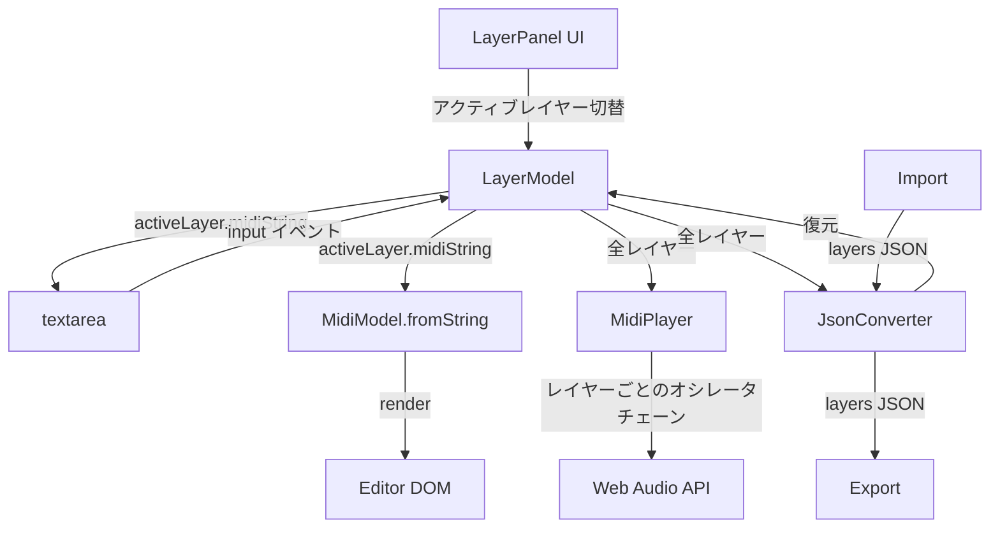

# 設計書: レイヤーエディタシステム

## 概要

MYNT MIDIのシングルノートエディタを、複数レイヤーを重ねて編集・再生できるレイヤーベースのシステムに拡張する。

現在のアーキテクチャでは、グローバルな`MidiModel`が単一のMIDI文字列を管理し、ヘッダーの`<select>`でオシレータタイプを1つだけ選択する構造になっている。本設計では、新たに`LayerModel`を導入し、各レイヤーが独立したMIDI文字列・オシレータタイプ・カラー・音量・ミュート/ソロ状態を持つ構造に拡張する。

### 段階的実装アプローチ

実装は3フェーズに分けて段階的に行う:

- **Phase 1**: データモデル（`LayerModel`）+ レイヤーパネルUI + アクティブレイヤー連動
- **Phase 2**: レイヤーごとの独立再生（オシレータタイプ分離、ミュート/ソロ）
- **Phase 3**: ピアノロールエディタのカラーコード表示 + JSON Import/Export対応

### 設計方針

- フレームワーク不使用（Vanilla JS + ES Modules + CSS + HTML）
- 既存の`MidiModel` / `MidiParser` / `MidiSerializer`はそのまま活用
- `LayerModel`が各レイヤーのメタデータを管理し、各レイヤーの`midiString`を`MidiModel`に渡す形で連携
- UIイベントは既存パターン（`addEventListener`ベース）に従う

## アーキテクチャ

### 現在のデータフロー

```
textarea → MidiModel.fromString() → モデル → render() → DOM
DOM操作 → MidiSerializer.syncToTextarea() → textarea
再生: textarea → MidiParser.get_code() → MidiPlayer.sound()
```

### レイヤー導入後のデータフロー



### モジュール構成

```
src/js/
├── midi/
│   ├── layer-model.js    ← 新規: レイヤーデータモデル
│   ├── model.js          ← 既存: 単一レイヤーのMIDIデータモデル（変更なし）
│   ├── parser.js         ← 既存（変更なし）
│   ├── player.js         ← 既存: レイヤー対応に拡張
│   ├── serializer.js     ← 既存（変更なし）
│   └── json-converter.js ← 既存: レイヤー形式対応に拡張
├── ui/
│   ├── layer-panel.js    ← 新規: レイヤーパネルUI
│   ├── editor.js         ← 既存: カラーコード表示に拡張
│   └── ...
├── css/
│   └── layer.css         ← 新規: レイヤーパネルスタイル
└── main.js               ← 既存: LayerPanel初期化を追加
```

## コンポーネントとインターフェース

### LayerModel（`src/js/midi/layer-model.js`）

レイヤーデータの一元管理モジュール。モジュールスコープの変数で状態を保持する（既存の`MidiModel`と同じパターン）。

```javascript
// --- 公開API ---

// レイヤー一覧の取得
LayerModel.layers        // → Layer[]

// アクティブレイヤー
LayerModel.activeLayer   // → Layer
LayerModel.setActive(id) // → void

// CRUD操作
LayerModel.addLayer()           // → Layer（新規レイヤーを追加）
LayerModel.removeLayer(id)      // → boolean（最後の1つは削除不可）
LayerModel.updateLayer(id, props) // → void（プロパティ更新）

// 初期化
LayerModel.init(midiString, oscillatorType) // → void（既存データから初期化）

// シリアライズ
LayerModel.toJSON()              // → object
LayerModel.fromJSON(data)        // → void

// イベント通知
LayerModel.onChange(callback)    // → void（変更時コールバック登録）
```

### LayerPanel（`src/js/ui/layer-panel.js`）

レイヤーパネルUIの生成・イベント管理。

```javascript
class LayerPanel {
  async init()           // DOM生成、イベント設定、初期描画
  render()               // LayerModelの状態からDOM全体を再描画
  renderRow(layer)       // 1レイヤー行のDOM生成
  setActiveHighlight(id) // アクティブレイヤーのハイライト更新
}
```

### MidiPlayer拡張（`src/js/midi/player.js`）

```javascript
// 既存: MidiPlayer.play(midi_string)
// 新規: レイヤー対応再生
MidiPlayer.playLayers(layers) // → { startTime, duration }
// layers: LayerModel.layersから取得した配列
// 各レイヤーに独立したオシレータ+ゲインチェーンを生成
```

### JsonConverter拡張（`src/js/midi/json-converter.js`）

```javascript
// 既存API（後方互換）
JsonConverter.toMidiString(json)  // 旧形式JSON → MIDI文字列
JsonConverter.toJson(midiStr)     // MIDI文字列 → 旧形式JSON

// 新規: レイヤー形式
JsonConverter.exportLayers(layers)    // LayerModel.layers → JSON文字列
JsonConverter.importLayers(jsonStr)   // JSON文字列 → LayerModel用データ
JsonConverter.detectFormat(jsonStr)   // → "1.0" | "2.0"
```

### Editor拡張（`src/js/ui/editor.js`）

```javascript
// 新規メソッド
Editor.renderAllLayers()           // 全レイヤーのノートを描画
Editor.setNoteColors(layerId, color, opacity) // ノートの色・透明度設定
```

## データモデル

### Layer オブジェクト

```javascript
{
  id: "layer_0",              // 一意識別子（"layer_" + 連番）
  name: "Layer 1",            // 表示名
  oscillatorType: "square",   // "sine" | "square" | "sawtooth" | "triangle"
  color: "#4A90D9",           // 表示色（カラーパレットから自動割り当て）
  midiString: "",             // MIDI文字列
  volume: 50,                 // 0〜100
  mute: false,                // ミュート状態
  solo: false                 // ソロ状態
}
```

### カラーパレット

```javascript
const LAYER_COLORS = [
  "#4A90D9",  // 青
  "#E85D75",  // 赤
  "#50C878",  // 緑
  "#F5A623",  // オレンジ
  "#9B59B6",  // 紫
  "#1ABC9C",  // ティール
  "#E67E22",  // ダークオレンジ
  "#3498DB",  // ライトブルー
]
```

### JSON Export形式（v2.0）

```json
{
  "format_version": "2.0",
  "layers": [
    {
      "id": "layer_0",
      "name": "Layer 1",
      "oscillatorType": "square",
      "color": "#4A90D9",
      "midiString": "T450O7EGO8ECDG",
      "volume": 50,
      "mute": false,
      "solo": false
    }
  ]
}
```

### JSON旧形式（v1.0 — 後方互換）

```json
{
  "bpm": 120,
  "notes": [
    { "pitch": "C4", "duration": "4n" }
  ]
}
```


## 正当性プロパティ（Correctness Properties）

*プロパティとは、システムの全ての有効な実行において成立すべき特性や振る舞いのことである。人間が読める仕様と、機械で検証可能な正当性保証の橋渡しとなる。*

### Property 1: レイヤー生成の不変条件

*For any* レイヤー追加操作の列に対して、生成された全てのレイヤーは以下を満たす:
- 全てのidが一意である
- 全てのプロパティ（id, name, oscillatorType, color, midiString, volume, mute, solo）が存在し正しい型を持つ
- colorが事前定義されたカラーパレットの要素である
- volumeが0〜100の範囲内である

**Validates: Requirements 1.1, 1.3, 1.6**

### Property 2: レイヤー削除の不変条件

*For any* 有効なレイヤーモデル状態に対して、レイヤーを削除した場合:
- レイヤーが2つ以上存在する場合、削除後のレイヤー数は1つ減少し、削除されたidのレイヤーは存在しない
- レイヤーが1つしか存在しない場合、削除は拒否され、レイヤー数は1のまま維持される

**Validates: Requirements 1.4, 1.5**

### Property 3: アクティブレイヤーとtextareaの双方向同期

*For any* レイヤーモデルとアクティブレイヤーの切り替えに対して:
- アクティブレイヤーを切り替えた後、textareaの値は新しいアクティブレイヤーのmidiStringと一致する
- textareaの値を変更した後、アクティブレイヤーのmidiStringはtextareaの値と一致する

**Validates: Requirements 4.1, 4.2**

### Property 4: 再生可能レイヤーのフィルタリング

*For any* レイヤー構成（各レイヤーのmute/solo状態の組み合わせ）に対して:
- いずれかのレイヤーがsolo状態の場合、再生可能レイヤーはsolo状態かつmute状態でないレイヤーのみ
- いずれのレイヤーもsolo状態でない場合、再生可能レイヤーはmute状態でない全レイヤー

**Validates: Requirements 6.4, 6.5**

### Property 5: レイヤー構成のラウンドトリップ

*For any* 有効なレイヤー構成に対して、エクスポート→インポート→エクスポートの結果が最初のエクスポート結果と等価である。具体的には、各レイヤーのid, name, oscillatorType, color, midiString, volume, mute, soloが全て保持される。

**Validates: Requirements 7.1, 7.2, 8.1**

### Property 6: 旧形式JSONのマイグレーション

*For any* 有効な旧形式JSON（bpm + notes構造、layers配列なし）に対して:
- フォーマット検出が "1.0" を返す
- インポート→エクスポートの結果がlayers配列を含む新形式JSON（format_version "2.0"）となる
- 元のノートデータ（pitch, duration）が単一レイヤーのmidiStringとして保持される

**Validates: Requirements 7.3, 7.5, 8.2**

## エラーハンドリング

### LayerModel

| エラー条件 | 対応 |
|---|---|
| 最後のレイヤーの削除試行 | `removeLayer()`が`false`を返し、レイヤーを維持 |
| 存在しないidへのsetActive | 無視（現在のアクティブレイヤーを維持） |
| 存在しないidへのupdateLayer | 無視 |
| 不正なvolume値（範囲外） | 0〜100にクランプ |
| 不正なoscillatorType | デフォルト値 "square" にフォールバック |

### JsonConverter

| エラー条件 | 対応 |
|---|---|
| 不正なJSON構文 | エラーメッセージをモーダルに表示 |
| layers配列が空 | デフォルトレイヤー1つで初期化 |
| レイヤーに必須フィールドが欠落 | デフォルト値で補完 |
| format_versionが未知 | 最新形式として処理を試行 |

### MidiPlayer

| エラー条件 | 対応 |
|---|---|
| 全レイヤーがミュート | 無音で再生（タイムバーは動作） |
| レイヤーのmidiStringが空 | そのレイヤーをスキップ |
| AudioContext生成失敗 | 既存のエラーハンドリングに従う |

## テスト戦略

### プロパティベーステスト（PBT）

本機能はデータモデルの操作、シリアライズ/デシリアライズ、フィルタリングロジックなど、純粋関数的な処理が多く、PBTに適している。

- ライブラリ: [fast-check](https://github.com/dubzzz/fast-check)（ブラウザ・Node.js両対応）
- 各プロパティテストは最低100イテレーション実行
- 各テストにはデザインドキュメントのプロパティ番号をタグ付け
- タグ形式: `Feature: layer-editor, Property {number}: {property_text}`

### テスト対象と手法

| 対象 | テスト手法 | 備考 |
|---|---|---|
| LayerModel CRUD操作 | PBT（Property 1, 2） | ランダムな操作列で不変条件を検証 |
| アクティブレイヤー同期 | PBT（Property 3） | ランダムなレイヤー切替とMIDI文字列で検証 |
| 再生可能レイヤーフィルタ | PBT（Property 4） | ランダムなmute/solo組み合わせで検証 |
| JSONラウンドトリップ | PBT（Property 5, 6） | ランダムなレイヤー構成で検証 |
| レイヤーパネルUI | Example-based | DOM要素の存在・イベント応答を検証 |
| エディタカラーコード表示 | Example-based | 色・透明度の正しい適用を検証 |
| レイヤー対応再生 | Integration | Web Audio APIとの統合を検証 |
| ヘッダーオシレータ非表示 | Example-based | DOM状態を検証 |

### テストファイル構成

```
src/js/__tests__/
├── layer-model.property.test.js   # Property 1, 2
├── layer-sync.property.test.js    # Property 3
├── layer-playable.property.test.js # Property 4
├── layer-json.property.test.js    # Property 5, 6
├── layer-panel.test.js            # UI example tests
└── layer-editor.test.js           # Editor example tests
```
