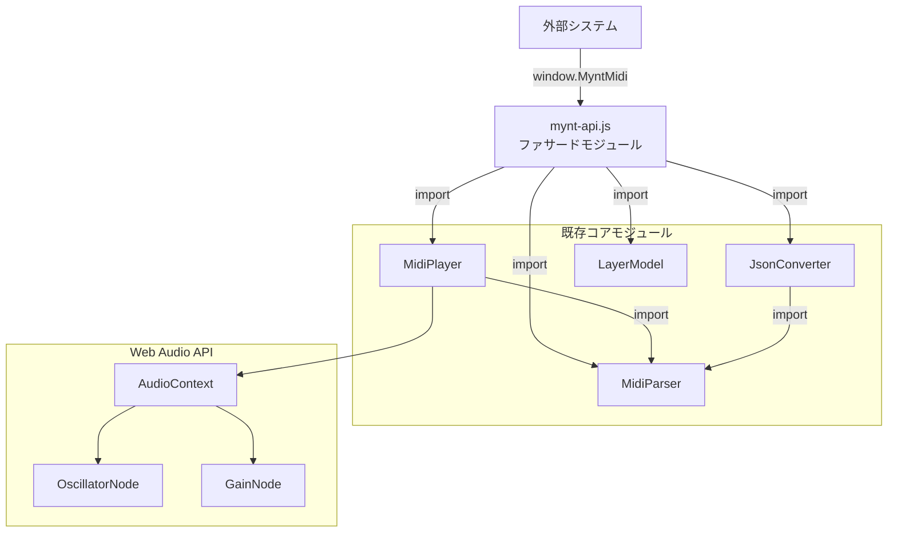
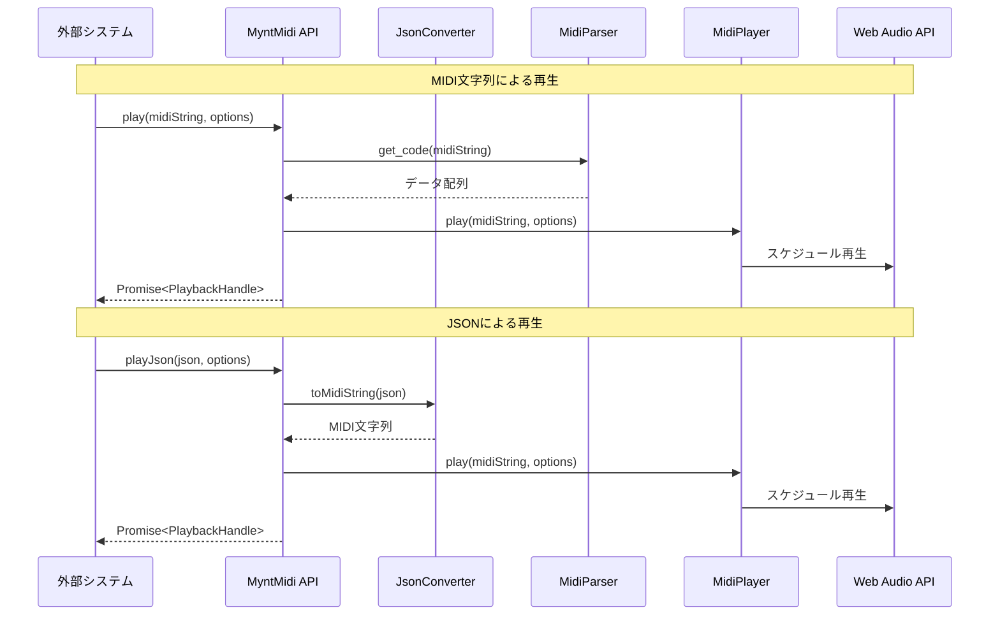
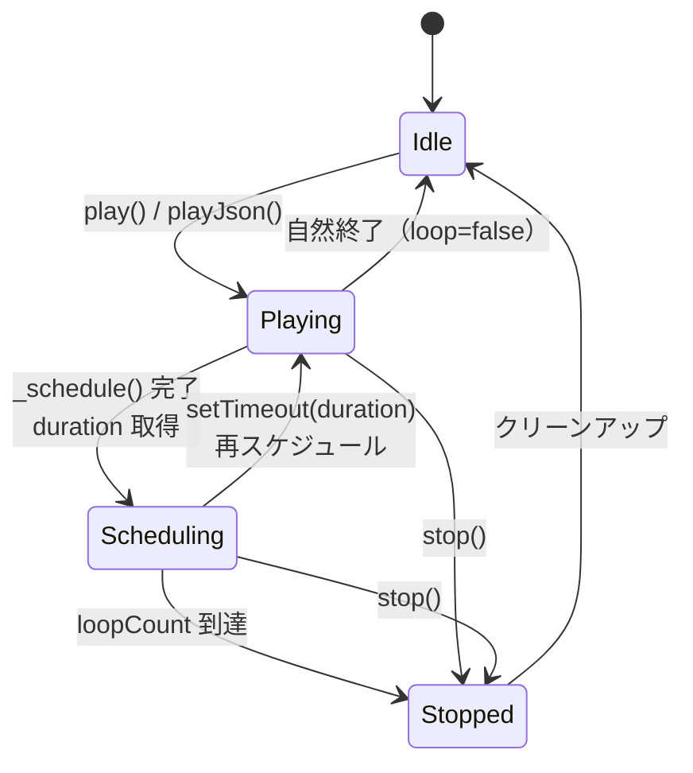
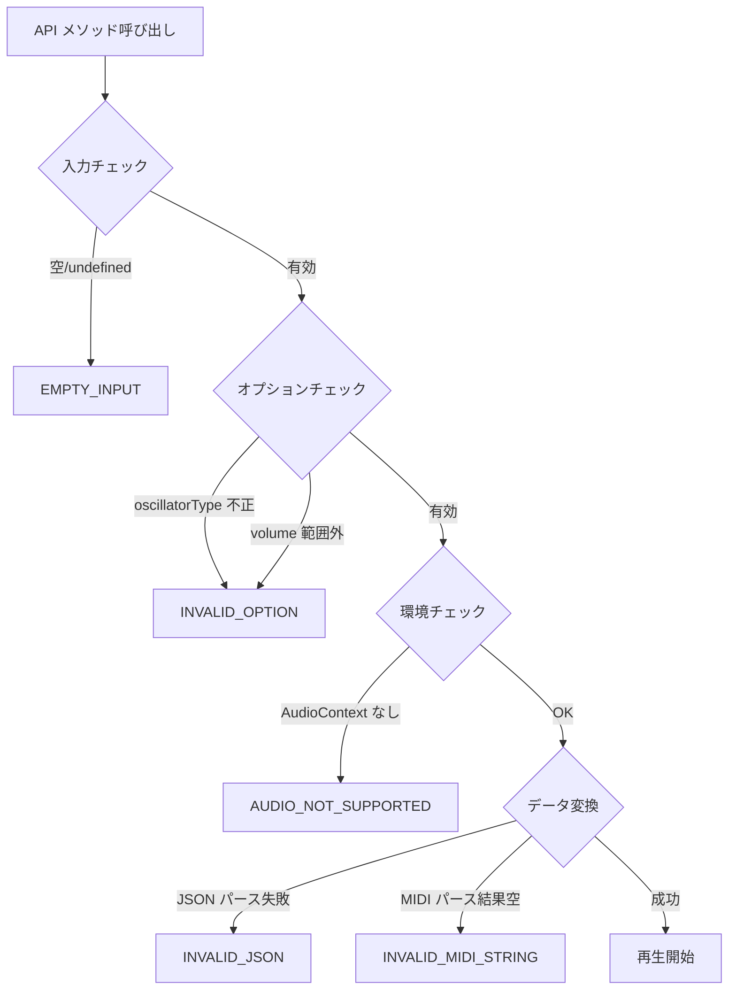

# 設計書: MYNT MIDI API モジュール

## 概要

MYNT MIDI の既存コアモジュール群（MidiParser, MidiPlayer, JsonConverter, LayerModel）を
ファサードパターンで統合し、`window.MyntMidi` として外部システムに公開する API モジュールを設計する。

API モジュールは `src/js/api/mynt-api.js` に配置し、ES Modules の `import` で既存モジュールを参照する。
外部からは `<script type="module">` タグで読み込み、`window.MyntMidi` 経由で全機能にアクセスする。

既存の Vanilla JS + ES Modules + 静的配信の方針を維持し、ビルドツールやフレームワークは導入しない。

### 設計上の重要な前提

- BUG-004 修正済み: `MidiPlayer.stop()` は AudioContext を破棄せず、`_activeNodes` で OscillatorNode を追跡して個別停止する
- BUG-006 修正済み: `MidiParser.get_code()` は常に配列を返す
- BUG-005 は制限事項: JSON 経由のラウンドトリップで ±1% 程度の誤差が生じる場合がある

## アーキテクチャ

### モジュール構成



### データフロー



### ループ再生のメカニズム



ループ再生は `MidiPlayer._schedule()` の戻り値 `{ startTime, duration }` の `duration` を使い、
`setTimeout(callback, duration * 1000)` で再スケジュールする。
`stop()` 時は `clearTimeout` でタイマーをキャンセルし、`MidiPlayer.stop()` で音声を即座に停止する。


## コンポーネントとインターフェース

### MyntMidi API（ファサードモジュール）

`src/js/api/mynt-api.js` に配置。以下の公開インターフェースを提供する。

```typescript
// 型定義（JSDoc で記述、実装は Vanilla JS）

interface MyntMidi {
  /** バージョン文字列 */
  version: string

  /**
   * MIDI文字列を再生する
   * @param midiString - MIDI文字列（例: "T450O7EGO8ECDG"）
   * @param options - 再生オプション
   * @returns PlaybackHandle を含む Promise
   */
  play(midiString: string, options?: PlayOptions): Promise<PlaybackHandle>

  /**
   * JSONデータを再生する
   * @param json - JSON_Format / Layers_JSON オブジェクトまたはJSON文字列
   * @param options - 再生オプション
   * @returns PlaybackHandle を含む Promise
   */
  playJson(json: object | string, options?: PlayOptions): Promise<PlaybackHandle>

  /**
   * 再生中の全音声を停止する
   */
  stop(): void

  /**
   * 再生中かどうかを返す
   */
  isPlaying(): boolean

  /**
   * JSON → MIDI文字列に変換する
   * @param json - JSON_Format オブジェクトまたはJSON文字列
   * @returns MIDI文字列
   */
  jsonToMidi(json: object | string): string

  /**
   * MIDI文字列 → JSON文字列に変換する
   * @param midiString - MIDI文字列
   * @returns JSON文字列
   */
  midiToJson(midiString: string): string

  /**
   * MIDI文字列のバリデーション
   * @param midiString - MIDI文字列
   * @returns バリデーション結果
   */
  validate(midiString: string): ValidationResult
}

interface PlayOptions {
  /** オシレータタイプ（デフォルト: "square"） */
  oscillatorType?: "sine" | "square" | "sawtooth" | "triangle"
  /** 音量 0〜100（デフォルト: 50） */
  volume?: number
  /** ループ再生（デフォルト: false） */
  loop?: boolean
  /** ループ回数（省略時: 無限） */
  loopCount?: number
}

interface PlaybackHandle {
  /** 再生状態: "playing" | "stopped" */
  status: string
  /** ループ中かどうか */
  looping: boolean
  /** 停止メソッド */
  stop(): void
}

interface ValidationResult {
  valid: boolean
  /** valid=true の場合: パースされた音符数 */
  noteCount?: number
  /** valid=false の場合: エラー情報 */
  error?: string
}

interface MyntMidiError {
  code: string
  message: string
}
```

### エラーコード一覧

| コード | 説明 | 発生条件 |
|---|---|---|
| `EMPTY_INPUT` | 入力が空 | `play()` に空文字列/undefined を渡した場合 |
| `INVALID_MIDI_STRING` | MIDI文字列が不正 | パース結果が空の場合 |
| `INVALID_JSON` | JSON構造が不正 | `playJson()` に不正なJSONを渡した場合 |
| `INVALID_OPTION` | オプション値が不正 | 不正な oscillatorType や volume 範囲外 |
| `AUDIO_NOT_SUPPORTED` | Web Audio API 非対応 | AudioContext が存在しない環境 |

### 内部状態管理

API モジュールは以下の内部状態をモジュールスコープ変数で管理する。

```javascript
// 再生状態
let _isPlaying = false
// ループ用タイマーID
let _loopTimerId = null
// 現在の PlaybackHandle
let _currentHandle = null
// ループ残回数（null = 無限）
let _loopRemaining = null
```

## データモデル

### JSON_Format（単一レイヤー）

AI 作曲連携用の JSON 形式。`JsonConverter.toMidiString()` で MIDI 文字列に変換可能。

```json
{
  "bpm": 120,
  "notes": [
    { "pitch": "C4", "duration": "4n", "velocity": 64 },
    { "pitch": "E4", "duration": "4n" },
    { "pitch": "rest", "duration": "8n" },
    { "pitch": ["C4", "E4", "G4"], "duration": "4n" },
    { "pitch": "fade", "duration": "4n" }
  ]
}
```

| フィールド | 型 | 必須 | 説明 |
|---|---|---|---|
| `bpm` | number | ○ | テンポ（BPM） |
| `notes` | array | ○ | 音符配列 |
| `notes[].pitch` | string \| string[] | ○ | 音名+オクターブ / "rest" / "fade" / 和音配列 |
| `notes[].duration` | string \| number | ○ | 音符の長さ（"4n","8n" 等）またはミリ秒 |
| `notes[].velocity` | number | - | 音量 0〜127（デフォルト: 64） |

### Layers_JSON（複数レイヤー）

```json
{
  "format_version": "2.0",
  "layers": [
    {
      "name": "Melody",
      "oscillatorType": "square",
      "volume": 80,
      "mute": false,
      "solo": false,
      "bpm": 120,
      "notes": [...]
    }
  ]
}
```

| フィールド | 型 | 必須 | 説明 |
|---|---|---|---|
| `format_version` | string | ○ | "2.0" 固定 |
| `layers` | array | ○ | レイヤー配列 |
| `layers[].name` | string | - | レイヤー名 |
| `layers[].oscillatorType` | string | - | オシレータタイプ |
| `layers[].volume` | number | - | 音量 0〜100 |
| `layers[].mute` | boolean | - | ミュート状態 |
| `layers[].solo` | boolean | - | ソロ状態 |
| `layers[].bpm` | number | - | テンポ |
| `layers[].notes` | array | ○ | 音符配列（JSON_Format と同形式） |

### MidiParser データ配列（内部形式）

`MidiParser.get_code()` が返す配列。API 内部でのみ使用。

```javascript
{
  O      : 5,           // オクターブ
  S      : "C",         // 音名 / "S" / "~" / "[...]"
  num    : 60,          // MIDIノート番号
  tempo  : 0.015,       // 音の長さ（秒）
  freq   : 261.63,      // 周波数（Hz）/ 和音時は配列
  volume : 50,          // 音量
  time   : 0.015,       // 累積再生時間（秒）
}
```

### PlaybackHandle 状態遷移

```
生成時: { status: "playing", looping: options.loop }
  ↓ stop() or 自然終了
終了時: { status: "stopped", looping: false }
```


## 正確性プロパティ

*プロパティとは、システムの全ての有効な実行において成り立つべき特性や振る舞いのことである。人間が読める仕様と、機械で検証可能な正確性保証の橋渡しとなる形式的な記述である。*

### Property 1: play() は有効なMIDI文字列に対して有効な PlaybackHandle を返す

*任意の* 有効なMIDI文字列（パース結果が1つ以上の音符を含む）に対して、`play(midiString)` は `{ status: "playing", looping: false, stop: Function }` の構造を持つ PlaybackHandle を含む resolved Promise を返す。

**Validates: Requirements 2.1, 2.2**

### Property 2: play() は volume オプションを正しく伝播する

*任意の* 0〜100 の整数 volume に対して、`play(midiString, { volume })` は MidiPlayer に同じ volume 値を渡して再生する。

**Validates: Requirements 2.4**

### Property 3: playJson() は有効な JSON_Format を変換して再生する

*任意の* 有効な JSON_Format オブジェクト（bpm と notes を含む）に対して、`playJson(json)` は JsonConverter.toMidiString() で MIDI 文字列に変換し、その結果で MidiPlayer.play() を呼び出す。

**Validates: Requirements 3.1**

### Property 4: loopCount は指定回数で再生を停止する

*任意の* 正の整数 N に対して、`play(midiString, { loop: true, loopCount: N })` は正確に N 回再生した後に自動停止し、PlaybackHandle の status が "stopped" になる。

**Validates: Requirements 4.4**

### Property 5: isPlaying() は再生状態を正確に反映する

*任意の* play() → stop() のシーケンスに対して、play() 後の isPlaying() は true を返し、stop() 後の isPlaying() は false を返す。

**Validates: Requirements 5.2**

### Property 6: validate() の noteCount はパーサー出力と一致する

*任意の* 有効なMIDI文字列に対して、`validate(midiString)` は `{ valid: true, noteCount: N }` を返し、N は `MidiParser.get_code(midiString).length` と等しい。

**Validates: Requirements 6.3**

### Property 7: JSON ラウンドトリップは音楽データを保存する

*任意の* 有効な JSON_Format オブジェクトに対して、`midiToJson(jsonToMidi(json))` の結果は元の JSON と同じ音符数を持ち、各音符の pitch が一致する。（BUG-005 の制限により、duration は ±1% の誤差を許容する）

**Validates: Requirements 6.5**

### Property 8: 不正なオプション値はエラーを返す

*任意の* 有効な4種類（"sine", "square", "sawtooth", "triangle"）以外の oscillatorType 文字列、または 0〜100 の範囲外の volume 値に対して、`play()` は `{ code: string, message: string }` 構造のエラーを含む rejected Promise を返す。

**Validates: Requirements 7.2, 7.3, 7.4**

### Property 9: 不正な JSON 構造はエラーを返す

*任意の* notes 配列を持たないオブジェクト、または bpm が欠落したオブジェクトに対して、`playJson()` は `{ code: string, message: string }` 構造のエラーを含む rejected Promise を返す。

**Validates: Requirements 3.4, 7.4**


## エラーハンドリング

### エラー生成ヘルパー

API モジュール内にエラーオブジェクト生成用のヘルパー関数を用意する。

```javascript
function createError(code, message) {
  return { code, message }
}
```

### エラーフロー



### バリデーション順序

1. 入力値の存在チェック（空文字列、undefined、null）
2. オプション値のバリデーション（oscillatorType、volume）
3. Web Audio API の利用可能性チェック
4. データ変換（JSON パース、MIDI パース）
5. 再生開始

この順序により、最も早い段階でエラーを検出し、不要な処理を回避する。

### 各メソッドのエラーハンドリング

| メソッド | エラー条件 | エラーコード |
|---|---|---|
| `play()` | 入力が空/undefined | `EMPTY_INPUT` |
| `play()` | パース結果が空 | `INVALID_MIDI_STRING` |
| `play()` | oscillatorType 不正 | `INVALID_OPTION` |
| `play()` | volume 範囲外 | `INVALID_OPTION` |
| `play()` | AudioContext なし | `AUDIO_NOT_SUPPORTED` |
| `playJson()` | JSON パース失敗 | `INVALID_JSON` |
| `playJson()` | notes/bpm 欠落 | `INVALID_JSON` |
| `playJson()` | 変換後の MIDI 文字列が空 | `INVALID_MIDI_STRING` |
| `jsonToMidi()` | JSON パース失敗 | 例外をスロー |
| `midiToJson()` | 入力が空 | 空の JSON を返す |
| `validate()` | — | エラーなし（常に結果オブジェクトを返す） |

### 非再生メソッドのエラー方針

`jsonToMidi()` と `midiToJson()` は同期メソッドのため、Promise ではなく例外をスローする。
`validate()` はバリデーション専用メソッドのため、エラーではなく `{ valid: false, error }` を返す。

## テスト戦略

### テストフレームワーク

- ユニットテスト / プロパティベーステスト: [fast-check](https://github.com/dubzzz/fast-check) + 任意のテストランナー（Vitest 推奨）
- ブラウザ環境のモック: `AudioContext` のモック実装

### プロパティベーステスト

本機能はファサードパターンによる API ラッパーであり、純粋関数やデータ変換ロジックを含む。
特にデータ変換（JSON ↔ MIDI文字列）、バリデーション、オプション検証は PBT に適している。

各プロパティテストは最低 100 回のイテレーションで実行する。

テストタグ形式: `Feature: mynt-midi-api, Property {number}: {property_text}`

#### カスタムジェネレーター

```javascript
// 有効なMIDI文字列ジェネレーター
const midiStringArb = fc.array(
  fc.oneof(
    fc.record({
      tempo: fc.integer({ min: 60, max: 4000 }),
      octave: fc.integer({ min: 0, max: 10 }),
      note: fc.constantFrom('C', 'D', 'E', 'F', 'G', 'A', 'B')
    })
  ),
  { minLength: 1, maxLength: 20 }
).map(notes =>
  notes.map(n => `T${n.tempo}O${n.octave}${n.note}`).join('')
)

// 有効な JSON_Format ジェネレーター
const jsonFormatArb = fc.record({
  bpm: fc.integer({ min: 40, max: 240 }),
  notes: fc.array(
    fc.record({
      pitch: fc.oneof(
        // 単音
        fc.tuple(
          fc.constantFrom('C', 'D', 'E', 'F', 'G', 'A', 'B'),
          fc.integer({ min: 2, max: 8 })
        ).map(([note, oct]) => `${note}${oct}`),
        // 休符
        fc.constant('rest')
      ),
      duration: fc.constantFrom('4n', '8n', '2n', '16n'),
      velocity: fc.integer({ min: 1, max: 127 })
    }),
    { minLength: 1, maxLength: 10 }
  )
})

// 不正な oscillatorType ジェネレーター
const invalidOscTypeArb = fc.string({ minLength: 1 })
  .filter(s => !['sine', 'square', 'sawtooth', 'triangle'].includes(s))

// 範囲外 volume ジェネレーター
const invalidVolumeArb = fc.oneof(
  fc.integer({ min: -1000, max: -1 }),
  fc.integer({ min: 101, max: 1000 })
)
```

### ユニットテスト

プロパティテストでカバーしきれない具体的なシナリオをユニットテストで補完する。

| テスト対象 | テスト内容 |
|---|---|
| `play()` 空入力 | 空文字列、undefined、null で EMPTY_INPUT エラー |
| `play()` オシレータタイプ | 4種類それぞれで正しく再生 |
| `playJson()` 文字列入力 | JSON文字列を渡して正しくパース |
| `playJson()` Layers_JSON | 複数レイヤーの同時再生 |
| `stop()` | 再生停止と状態クリーンアップ |
| ループ再生 | loop=true で再スケジュール |
| ループ停止 | ループ中の stop() でタイマーキャンセル |
| 自然終了 | 再生完了後の handle.status 更新 |
| 排他制御 | 連続 play() で前の再生が停止 |
| AudioContext なし | AUDIO_NOT_SUPPORTED エラー |
| `validate()` 無効入力 | パース不可能な文字列で { valid: false } |

### テストのモック方針

- `MidiPlayer`: AudioContext と OscillatorNode をモック化し、スケジューリングロジックのみテスト
- `setTimeout` / `clearTimeout`: ループ再生テスト用にタイマーをモック化
- `window.AudioContext`: 環境チェックテスト用に undefined に設定

